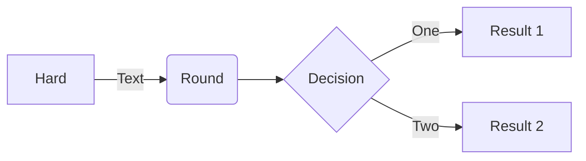
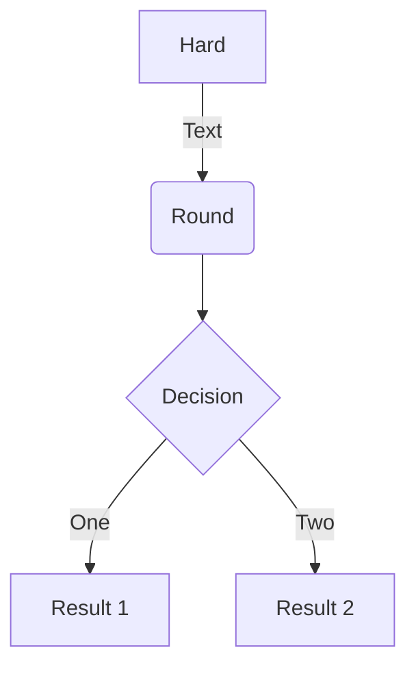

[参考](https://zhuanlan.zhihu.com/p/610245236)

[参考](https://blog.csdn.net/weixin_44386939/article/details/122465269)

[参考](https://blog.csdn.net/qq_41581588/article/details/129831530)

````

````



